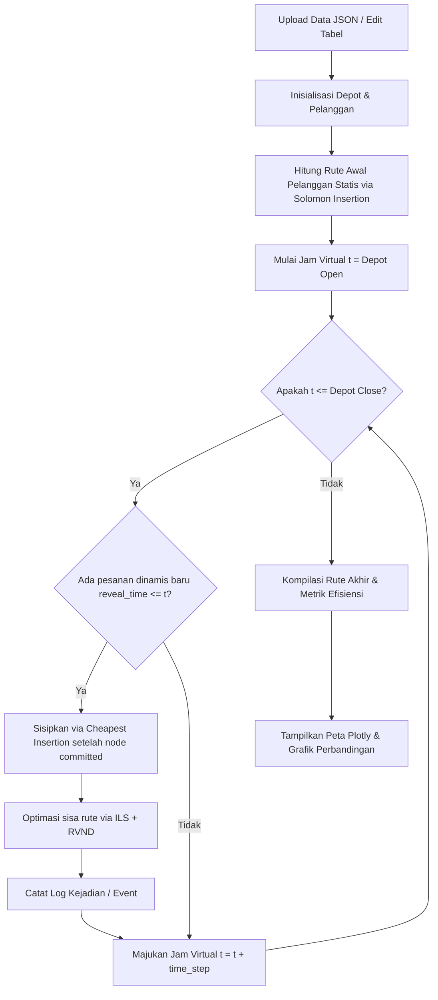

# Panduan Penjelasan Aplikasi Dashboard DVRPTW

Dokumen ini menjelaskan rancangan, fitur, dan cara pengoperasian aplikasi **Dashboard DVRPTW (Dynamic Vehicle Routing Problem with Time Windows)** yang telah dibangun menggunakan Streamlit. Dokumen ini berfungsi sebagai referensi penyusunan Bab IV (Hasil dan Pembahasan) atau panduan demonstrasi aplikasi pada sidang tugas akhir.

---

## 1. Gambaran Umum Sistem

Aplikasi ini dirancang sebagai alat bantu keputusan (*Decision Support Tool*) untuk mengoptimalkan rute pengiriman barang secara dinamis. Antarmuka aplikasi dibuat menggunakan **Streamlit** (Python) dengan tema visual **Dark Navy Blue Premium** untuk memberikan kesan akademis sekaligus modern dan profesional.

Dashboard ini menghubungkan tiga komponen utama:

1. **Antarmuka Input Data**: Memungkinkan untuk mengunggah berkas konfigurasi VRP (`.json`) atau mengedit tabel pelanggan statis, pelanggan dinamis, serta matriks jarak dan waktu tempuh secara langsung (interaktif).
2. **Mesin Solver DVRPTW (`solver.py`)**: Menjalankan simulasi berbasis waktu (*discrete event simulation*) untuk menyisipkan pesanan baru secara real-time dan mengoptimalkan rute menggunakan algoritma ILS + RVND.
3. **Visualisasi & Analisis**: Menggunakan pustaka **Plotly** untuk menggambar peta rute interaktif dalam koordinat 2D (dihitung menggunakan metode *Multi-Dimensional Scaling* / MDS berdasarkan matriks jarak nyata) serta grafik batang analisis efisiensi.

---

## 2. Struktur Menu Aplikasi

Aplikasi dibagi menjadi 5 menu navigasi utama di bilah sisi (*sidebar*):

### A. Beranda (Home)

* **Fungsi**: Halaman pengantar yang menjelaskan latar belakang masalah DVRPTW, batasan model (kapasitas kendaraan 2500 kg, non-preemption, dll.), serta ringkasan metode optimasi yang digunakan (Sequential Insertion, Cheapest Insertion, dan Metaheuristik ILS + RVND).
* **Tampilan**: Dilengkapi dengan *Hero Banner* akademis Universitas Negeri Malang.

### B. Data Pelanggan (Customer Data)

* **Fungsi**: Gerbang masuk data. Seperti :
  - Mengunggah berkas JSON dataset.
  - Menentukan jumlah pelanggan statis dan dinamis.
  - Mengedit parameter pelanggan: ID, Demand (kg), Service Time (detik/jam), dan Reveal Time (khusus pelanggan dinamis).
  - Mengedit matriks jarak (km) dan matriks waktu tempuh (jam) antar lokasi melalui tabel interaktif.

### C. Konfigurasi Armada (Fleet Configuration)

* **Fungsi**: Mengatur kapasitas maksimal tiap kendaraan (default: 2500 kg), kecepatan rata-rata (default: 60 km/jam), jumlah armada kendaraan yang tersedia (default: 2), serta jam operasional depot (jam buka $e_0 = 4.0$ s.d jam tutup $l_0 = 7.0$).

### D. Simulasi DVRPTW (Simulation Engine)

* **Fungsi**: Pusat eksekusi simulasi dinamis. Seperti :
  - Memilih apakah ingin menerapkan optimasi RVND atau tidak (untuk melihat perbandingan efisiensi).
  - Mengunci acakan algoritma (*Fixed Seed*) agar hasil rute selalu konsisten saat diuji ulang.
  - Menekan tombol **"Jalankan Simulasi DVRPTW"** untuk memutar jam virtual.
  - Melihat riwayat log langkah-demi-langkah (kapan pesanan dinamis masuk, di mana ia disisipkan, dan bagaimana rute dioptimalkan ulang).

### E. Analisis Hasil (Results Analysis)

* **Fungsi**: Halaman perbandingan performa. Halaman ini menyajikan:
  - Metrik performa akhir: Total Jarak Tempuh (km), Waktu Operasional total (jam/menit), dan Jumlah Kendaraan Terpakai.
  - **Peta Rute Interaktif**: Rute perjalanan masing-masing kendaraan yang digambar dengan warna berbeda, lengkap dengan arah panah kunjungan.
  - **Analisis Dynamic Overhead Gap**: Menghitung seberapa efisien solusi dinamis (*online*) jika dibandingkan dengan solusi ideal (*offline benchmark* / jika semua pesanan sudah diketahui sejak awal).

---

## 3. Alur Kerja Aplikasi (Workflow)

Di balik layar, berikut adalah urutan eksekusi aplikasi saat tombol simulasi ditekan:

Panduan ini memberikan dasar pemahaman yang kuat bagi siapa saja yang ingin memahami fungsionalitas sistem dari sudut pandang perangkat lunak.
